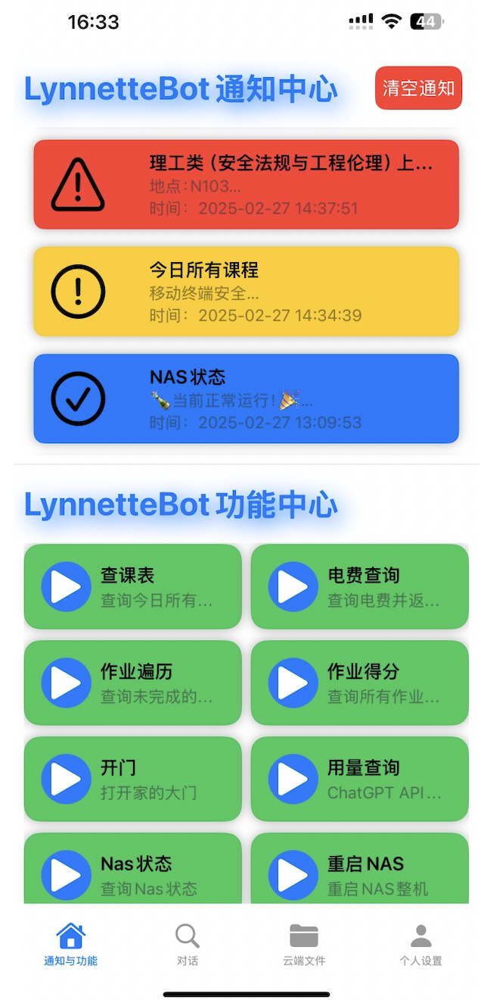
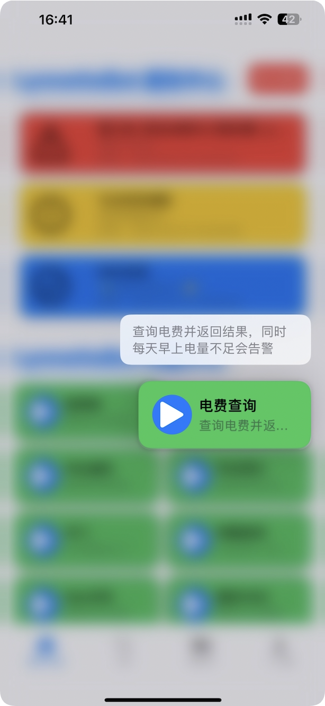
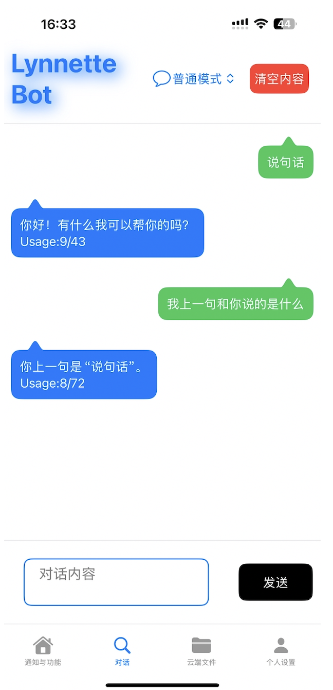
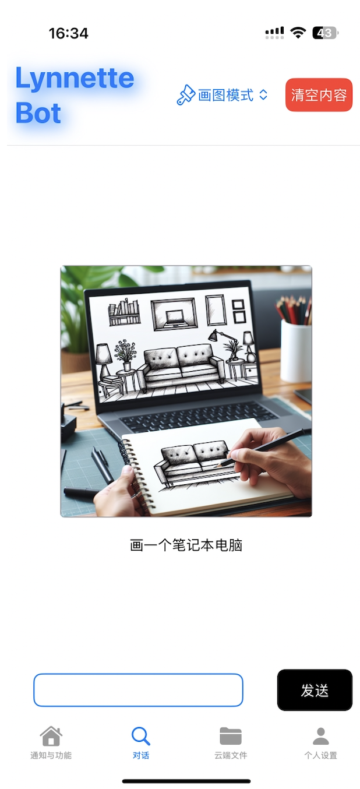
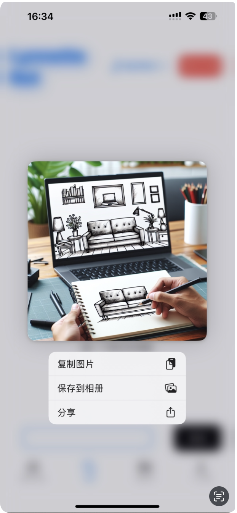
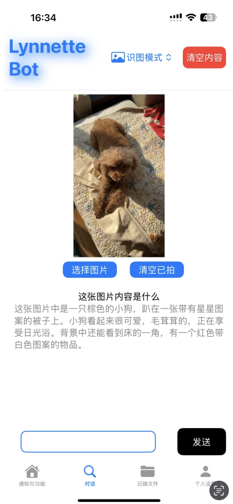
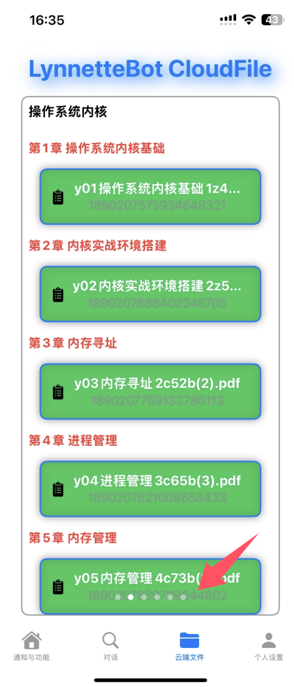

# LynnetteBot

​	一款iOS客户端，支持通知、任务执行、定时任务、AI对话的机器人软件

## 客户端

基于Swift开发。

主要功能：获取来自服务器端的通知、控制服务器的功能执行、与服务器部署的AI进行对话、使AI画图、识图，包括云文件(这里是北邮的云平台的文件)

### 主页

​	主页包括通知中心和功能中心。前者是来自服务器的通知，后者是服务器支持的所有可供用户执行的功能(功能和信息来自于服务器，UI仿照快捷指令)。通知支持点击查看详情，功能支持长按查看详情。

​	通知具有三种优先级，分别是紧急、中等、普通，将采用不同的颜色展示出来。功能执行时，图标会变成漏斗。等待执行完成后回复图标。

### 对话

右上角支持选择四种模式：普通、精准、画图、识图。对于前二者服务器分别选4omini和4o模型进行回复。由客户端保留对话记录。支持长按复制和分享。画图和识图则与对话类似。当服务器还没有回复的时候，按钮会变成灰色的思考中。

### 云端文件

与北邮云平台联动，由服务端获取所有文件，下发文件名称和ID。客户端可以根据ID向服务器请求文件URL，效果是点击后即可跳转到浏览器下载。

## 服务端

服务端主要基于python+flask开发，非常简单。维护了一个用户列表，提供了一些api。比如为用户插入通知等。新的通知一方面通过客户端直接下发给用户，另一方面每次进行通知插入都会调用pushover的api推送通知到用户手机，这样对于个人来讲推送通知的成本也是极低的。

另一方面，接入了北邮的微信教务、云平台，可以处理用户的课程表，实现上课前提醒、云平台通知提醒、作业查询等。提供了上传和提交作业的接口，但这里还没有做和客户端的适配。

scheduletask内是所有的定时任务，可以仿照格式添加定时任务。

task内是所有支持与用户交互的功能，分为可执行和不可执行两种。

